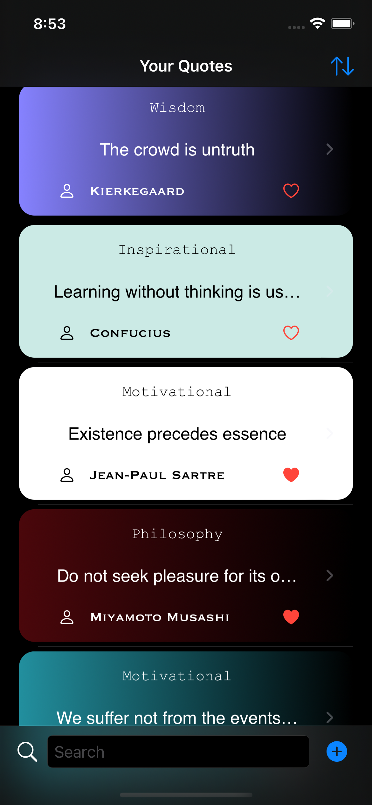
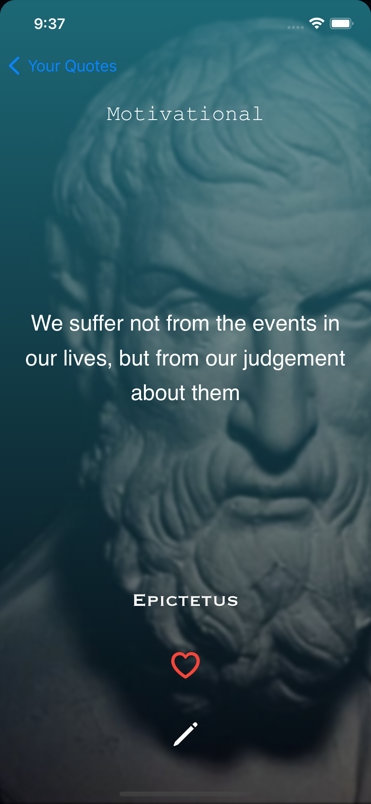
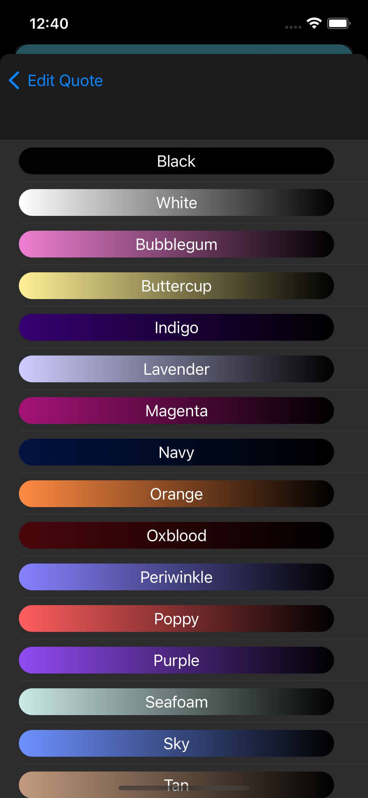
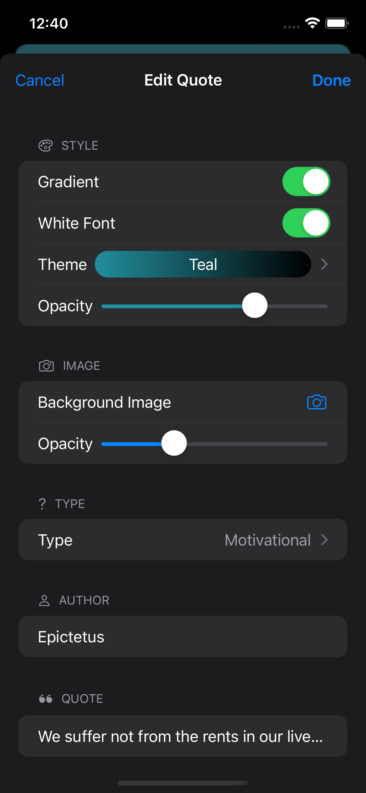
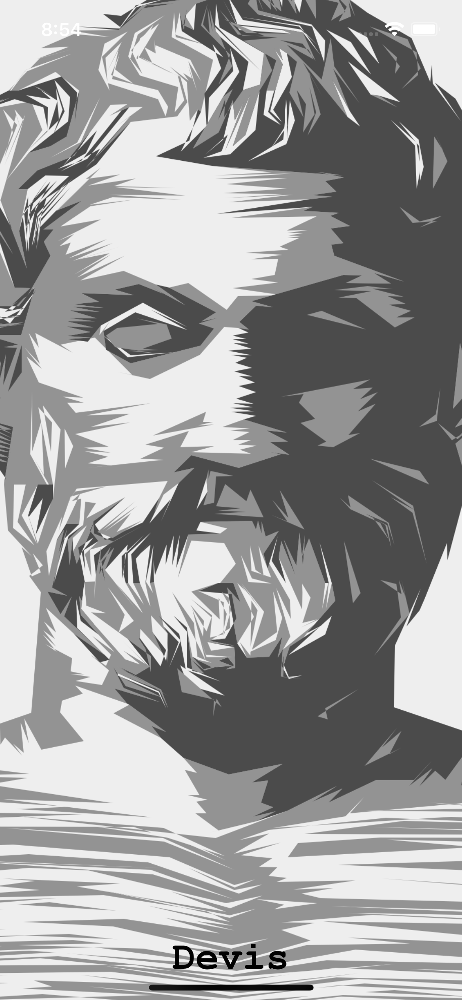

#  Devis

An app to store and view your quotes in a minimalistic style.
  

# Features
1. ### View all your quotes
 

2. ### Present your quotes in a minimalistic style

3. ### Add new quotes

4. ### Choose between colourful hemes

5. ### Edit existing quotes

6. ### Splash Screen

  

# Known Problems

1. Edit button (pencil icon) not visible with light mode and white background.
2. Background images not visible with white theme.
3. Background images not visible with low opacity colours + light theme.

